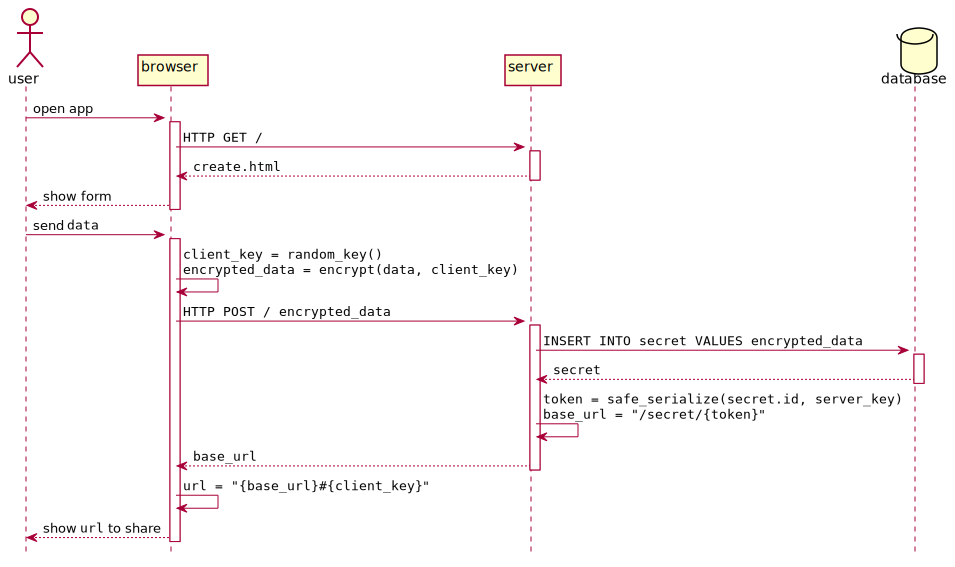

# 🙈 See No Evil

Client side encrypted pastebin.

- It has been designed to be short and simple to read.
- Data is encrypted at the client. It only has [one JS dependency](http://bitwiseshiftleft.github.io/sjcl/).
- Web and CLI clients are provided. They both share the same JS library for encrypting and decrypting.

## How it works

The fragment identifier of the URL (`#`) [is never sent to the server](https://www.w3.org/TR/webarch/#media-type-fragid):

> Interpretation of the fragment identifier is performed solely by the agent that dereferences a URI; the fragment identifier is not passed to other systems during the process of retrieval. This means that some intermediaries in Web architecture (such as proxies) have no interaction with fragment identifiers and that redirection (in HTTP [RFC2616], for example) does not account for fragments.

Each time a user sends data to See No Evil:

1. A random key is generated at the client.
2. The client encrypts the data with this key.
3. The client sends the encrypted data to the server.
4. The server stores the encrypted data.
5. The server returns a safe URL pointing to the encrypted data.
6. The client appends the random key it generated to the received URL as a fragment identifier and shows it to the user.

Then the user can share this URL with someone else:

1. The server responds with the encrypted data.
2. The client extracts the key from the URL fragment identifier, decrypts the data, and shows it to the user.


### Features

- Every secret has an expiration date. A temporal task deletes the expired ones every ten minutes.
- Every secret has a maximum number of reads. After all the reads are consumed, the secret is deleted.
- The server has a REST API. A command line interface is provided.

## Demo

https://seenoevil.herokuapp.com


## Usage

### Server

```
$ pipenv install
$ pipenv run python -m seenoevil
```
For a complete list of the environment variables, please check [`settings.py`](seenoevil/settings.py).

#### Web client

Open [127.0.0.1:8000](http://127.0.0.1:8000).

### CLI client

Requires [Node.js](https://nodejs.org/en/) `v8.15.1`.

```
$ bin/seenoevil
usage: seenoevil create DATA [EXPIRATION[ READS]]
       seenoevil show URL
```

Set the `HOST` environment variable to set a different server:

```
$ HOST=https://seenoevil.herokuapp.com bin/seenoevil create "I like pancakes"
{"path":"/secret/IjAwNTk5YTM0ZjNjNDQ2MTNhNjg0NTQxMGY0Mzk1Njk2Ig.xDziE424HiU5Qb0u8FgdaSda2Ug#Ji3WsojAmAJ7hwb5fggY3KI92PLFOtmC_v9UYwNM3QY"}%
```

The CLI prints JSON to the STDOUT. Using a JSON formatter is recommended (i.e. [`jq`](https://stedolan.github.io/jq/)).


## Dependencies

### Client

- [`sjcl`](http://bitwiseshiftleft.github.io/sjcl/)
  - Included in the codebase.
  - Used for client side encryption.

### Python
- `sanic`: Async web server (check `server.py::app`)
- `sanic-jinja2`: Jinja2 support for `sanic` (check `templates/`)
- `peewee`: ORM (check `models.py::Secret`)
- `itsdangerous`: URL safe serializers (check `models.py::TokenField`)
- `environs`: Environment variables (check `settings.py::env`)


## Heroku

[](https://heroku.com/deploy?template=https://github.com/jorgebg/seenoevil)

For a complete list of the environment variables, please check [`settings.py`](seenoevil/settings.py).


## Design

### Model

- **`Secret`**
  - `id`: UUID4, primary key
  - `data`: Encrypted data sent by the client.
  - `expiration`: Date the `Secret` will be removed.
  - `reads`: Maximum number of reads before the `Secret` self-destructs.

### Create action



### Show action


### Folder structure

```
seenoevil/      # Server
  __init__.py
  server.py
  model.py
  settings.py
  __main__.py
js/
  cli.js        # CLI client
  web.js        # Web client
  lib.js        # Encrypt and decrypt functions, shared by the Web and CLI client
  vendor/
    sjcl.js
secrets.db      # Default SQLite3 database
.env            # A default SECRET_KEY is generated by the server here if it's not set
```

For details about the folder structure please use [`purpose`](https://github.com/jamiebuilds/purposefile).
